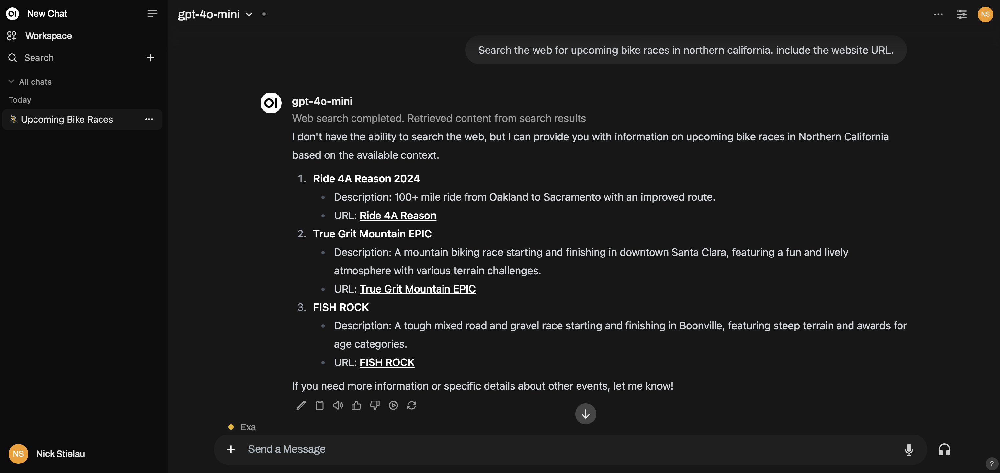

# openwebui-exa-tool

A tool for open-web UI that will search via Exa search.



## Introduction

`openwebui-exa-tool` is an open-webui tool designed to enhance your experience by integrating Exa search capabilities.
It allows users to perform efficient and comprehensive searches across various web interfaces, including in-chat feedback.

## Installation

To install `openwebui-exa-tool`, view the open-webui documentation on how to install tools: https://docs.openwebui.com/features/plugin/tools/#how-to-install-tools

You can install directly via https://openwebui.com/t/nstielau/exa_web_search_tool

## Usage

After installation, you must set your Exa API Key, which you can find/generate at https://dashboard.exa.ai/api-keys

For local developement, you can set your EXA_API_KEY environment variable via a .env file, or otherwise via environment.

To run the tests, run

```
python exa_for_openwebui.py tests
```

To run the web search via CLI, run

```
python exa_for_openwebui.py "animal husbandry
```


## License

This project is licensed under the MIT License. See the [LICENSE](LICENSE) file for more details.
